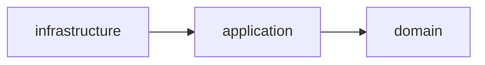
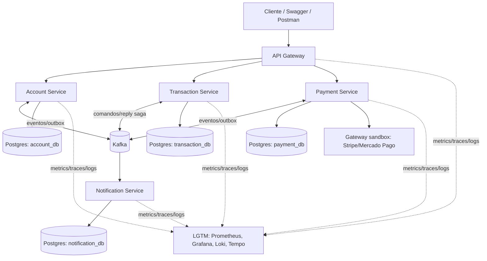

# Architecture Spine — Sistema de Carteira Digital Distribuída

## Design Paradigm

Cada microsserviço segue **Hexagonal / Ports & Adapters** internamente. Entre serviços, o sistema é uma **Saga orquestrada sobre backbone assíncrono (Kafka)**, com **Outbox** (publicação) e **Inbox** (deduplicação) garantindo consistência sem dual-write.

Mapeamento de camadas (por serviço):

```text
{service}/
  domain/          # entidades, regras de negócio puras, sem dependência de framework
  application/      # casos de uso, orquestração de domínio, portas (interfaces)
  infrastructure/    # adapters: REST controllers, Kafka producer/consumer, JPA repositories
```

## Invariants & Rules

### AD-1 — Saga de transferência: máquina de estados própria, assíncrona
- **Binds:** FR-7, FR-9 (Transaction Service)
- **Prevents:** lock-in em framework de saga (Axon), acoplamento síncrono entre orquestrador e participantes, e schema de saga inventado de forma diferente por quem implementa cada step.
- **Rule:** o fluxo Reserve→Confirm→Compensate é uma máquina de estados própria dentro do Transaction Service, persistida em duas tabelas fixas:
  - `saga_instance(saga_id PK, transaction_id, status ENUM[STARTED,RESERVED,CONFIRMED,COMPENSATING,COMPENSATED,FAILED], version INT, created_at, updated_at)` — toda transição de `status` é um `UPDATE ... WHERE saga_id = ? AND version = ?` (optimistic lock); update com 0 linhas afetadas = conflito, e o handler aborta/reprocessa em vez de sobrescrever.
  - `saga_step(saga_id FK, step_name, status, occurred_at)` — uma linha por tentativa de step, nunca sobrescrita.
  - Toda comunicação orquestrador↔participantes é assíncrona via tópicos Kafka de comando/reply — nunca chamada REST síncrona entre eles. Todo comando e reply de saga carrega `sagaId` obrigatório no payload (além do `aggregateId` do envelope — ver AD-9), usado como chave de lookup em `saga_instance`; um reply sem `sagaId` correspondente é descartado e logado como erro.

### AD-2 — Outbox via polling publisher
- **Binds:** todos os serviços que publicam eventos (Account, Transaction, Payment, Notification)
- **Prevents:** inconsistência de dual-write entre banco local e evento publicado; infraestrutura extra de CDC fora do escopo do projeto.
- **Rule:** toda escrita que precisa publicar um evento grava também uma linha em `outbox` na mesma transação local. Um scheduler (por serviço) lê `outbox` (status `PENDING`), publica no Kafka e marca `PUBLISHED`. Linhas `PUBLISHED` com mais de 7 dias são elegíveis para purge.

### AD-3 — Idempotência via Inbox
- **Binds:** FR-5, FR-11, FR-14 (todo consumidor de comando/evento)
- **Prevents:** processamento duplicado em retry ou redelivery do Kafka.
- **Rule:** todo consumidor mantém tabela `inbox(event_id PK, processed_at, result_ref)`. `event_id` (do envelope, AD-9) é a única chave de deduplicação — nunca uma chave de negócio alternativa. Para requests síncronos sem envelope (ex: header de idempotência HTTP), a chave de idempotência do cliente é normalizada para um `event_id` sintético antes de checar o Inbox, mantendo uma única tabela e uma única regra de lookup. Antes de processar, verifica se já existe; se sim, descarta silenciosamente e responde com o resultado já registrado. Linhas com mais de 7 dias são elegíveis para purge (mesma janela do Outbox, AD-2).

### AD-4 — Ledger é event-sourced; saldo tem um único dono
- **Binds:** FR-4, FR-6, FR-8 (Transaction Service, Account Service)
- **Rule:** `events` (Transaction Service) é append-only, fonte única da verdade do saldo, com constraint `UNIQUE(account_id, version)` para concorrência otimista. O **Transaction Service é o único dono do saldo**; nenhum outro serviço o calcula ou escreve. O Account Service **não** guarda saldo como campo próprio de escrita — o endpoint `FR-4 GET /accounts/{id}/balance` é servido por uma projeção local (`account_balance_cache`) mantida só pelo consumo do evento `BalanceChanged` publicado pelo Transaction Service; nenhum código do Account Service pode escrever nesse campo por outro caminho. Toda mudança de saldo nasce de um evento novo no Transaction Service.
- **Prevents:** sobrescrita de saldo, lost updates sob concorrência, e duas fontes de verdade de saldo (Account vs. Transaction).

### AD-5 — Database-per-service, sem acesso cruzado
- **Binds:** all
- **Rule:** cada serviço tem seu próprio banco Postgres; nenhum serviço acessa schema/tabela de outro diretamente. Todo dado de outro serviço chega via API síncrona do dono ou via evento Kafka publicado por ele.
- **Prevents:** acoplamento oculto via tabelas compartilhadas.

### AD-6 — Circuit breaker em toda chamada síncrona externa ao serviço
- **Binds:** FR-15, API Gateway, Payment Service (gateway sandbox), Notification Service (se o canal de entrega usar um provedor externo síncrono)
- **Rule:** toda chamada HTTP saindo de um serviço (Gateway → serviços internos, Payment Service → gateway sandbox, Notification Service → provedor externo de entrega, quando aplicável) passa por Resilience4j com fallback explícito (fail-fast retornando erro estruturado — nunca sucesso silencioso). Um consumidor Kafka que falha ao entregar (ex: provedor externo indisponível) não deve reprocessar indefinidamente sem backoff — aplica-se retry limitado + circuit breaker antes de mover a mensagem para dead-letter.
- **Prevents:** falha em cascata quando uma dependência está lenta ou fora do ar.

### AD-7 — Dependência interna sempre para dentro (Hexagonal)
- **Binds:** all
- **Rule:** `infrastructure` depende de `application`, que depende de `domain`. `domain` não importa nada de `application` ou `infrastructure`, nem anotações de framework (JPA/Spring) em suas classes centrais.
- **Prevents:** lógica de negócio vazando para controllers/repositories; domínio acoplado a framework.



### AD-8 — API Gateway é o único ponto de entrada público
- **Binds:** FR-1, FR-2
- **Rule:** serviços internos não são expostos fora da rede Docker/K8s. Autenticação (JWT) é validada uma única vez no Gateway; serviços internos confiam no header de identidade repassado pelo Gateway.
- **Prevents:** lógica de auth duplicada e inconsistente por serviço.

### AD-9 — Envelope de evento comum
- **Binds:** all (tópicos Kafka)
- **Rule:** toda mensagem Kafka usa o envelope `{eventId, eventType, version, occurredAt, aggregateId, payload}` (`version` = inteiro `major`, sem minor). Para tópicos de comando/reply de saga, `aggregateId` = `sagaId` (ver AD-1); para os demais tópicos, `aggregateId` = id do agregado de negócio (ex: `accountId`). Política de versionamento obrigatória: mudança aditiva de campo em `payload` NÃO incrementa `version` e consumidores devem ignorar campos desconhecidos; qualquer mudança que remova/renomeie/mude o tipo de um campo existente incrementa `version`, e o consumidor deve tratar `version` não suportada rejeitando a mensagem para uma dead-letter queue — nunca tentar parsear "na tentativa".
- **Prevents:** consumidores quebrando silenciosamente na evolução do schema.

## Consistency Conventions

| Concern | Convention |
| --- | --- |
| Naming (tópicos, entidades, endpoints) | Tópicos Kafka: `{domínio}.{commands\|events\|saga-replies}` (ex: `transaction.commands`, `account.events`, `transaction.saga-replies` — replies de saga sempre em tópico `.saga-replies` dedicado, nunca reaproveitando `.events`). Entidades: PascalCase. Endpoints REST: plural kebab-case (`/accounts/{id}/balance`). |
| Data & formats (ids, datas, erros, envelope) | IDs: UUID v4. Datas: ISO-8601 UTC. Erro HTTP: `{code, message, traceId}`. Envelope de evento: ver AD-9. |
| State & cross-cutting (mutação, logging, config, auth) | Mutação só via método de agregado — inclui explicitamente `saga_instance` (transição de estado só pela máquina de estados do orquestrador, nunca `UPDATE` avulso) e saldo (só via AD-4). Logging estruturado (JSON) com `traceId`/`spanId` via MDC. Config via Spring Config + variáveis de ambiente (sem valores sensíveis versionados). Auth: JWT validado no Gateway (AD-8). |

## Stack

<!-- A verificação automática de versões foi interrompida antes de concluir. Pins abaixo são a base de referência (BOM Spring Boot/Cloud consistente entre si) — confirmar o GA mais recente de cada linha marcada (verificar) no momento em que o setup do projeto começar, antes de fixar em pom.xml/docker-compose. -->

| Name | Version |
| --- | --- |
| Java | 21 (LTS) |
| Spring Boot | 3.4.x (verificar GA mais recente) |
| Spring Cloud (Gateway, OpenFeign, Config) | 2024.0.x — trem compatível com Spring Boot 3.4.x (verificar) |
| Apache Kafka | 3.8.x |
| PostgreSQL | 16 |
| Redis | 7.4 |
| Resilience4j | 2.2.x |
| Micrometer + Micrometer Tracing | versão gerenciada pelo BOM do Spring Boot escolhido acima (não pinar solto) |
| OpenTelemetry (SDK + Collector) | verificar GA mais recente compatível com o Micrometer Tracing acima |
| Prometheus | verificar GA mais recente |
| Grafana | verificar GA mais recente |
| Loki | verificar GA mais recente |
| Tempo | verificar GA mais recente |
| Docker Compose | v2 |
| Kubernetes (Minikube/Kind, demo) | verificar GA mais recente |
| GitHub Actions | n/a (SaaS) |

## Structural Seed



**Deployment & Environments**: um único ambiente (`local`), sem staging/produção — escopo de portfólio. Docker Compose é o modo padrão de subir tudo (serviços + Kafka + Postgres x4 + Redis + stack LGTM). Manifests Kubernetes (Minikube/Kind) usam as mesmas imagens Docker, como demonstração adicional de containerização orquestrada, não como requisito de deploy real.

**Árvore de repositório** (monorepo, multi-módulo Maven):

```text
digital-wallet/
  account-service/
  transaction-service/
  payment-service/
  notification-service/
  api-gateway/
  docker-compose.yml
  k8s/            # manifests de demonstração (Minikube/Kind)
  observability/  # configs Prometheus/Grafana/Loki/Tempo
```

## Deferred

- **Avro + Schema Registry** — adiado; envelope JSON versionado (AD-9) resolve o suficiente pro escopo do MVP. Reconsiderar se o número de consumidores/schemas crescer.
- **Debezium/CDC no lugar do polling publisher** — adiado (AD-2); revisitar se o delay de publicação por polling se mostrar um problema real em teste de carga.
- **Multi-moeda, KYC real, detecção de fraude, multi-tenancy** — fora de escopo do PRD; não modelado aqui.
- **Staging/produção, autoscaling, multi-região** — não se aplica a um projeto de portfólio de ambiente único.
- **Framework de saga (Axon) ou motor de workflow (Camunda/Temporal)** — adiado conscientemente (AD-1) em favor de implementação própria; documentar publicamente o trade-off é parte do valor de portfólio.
